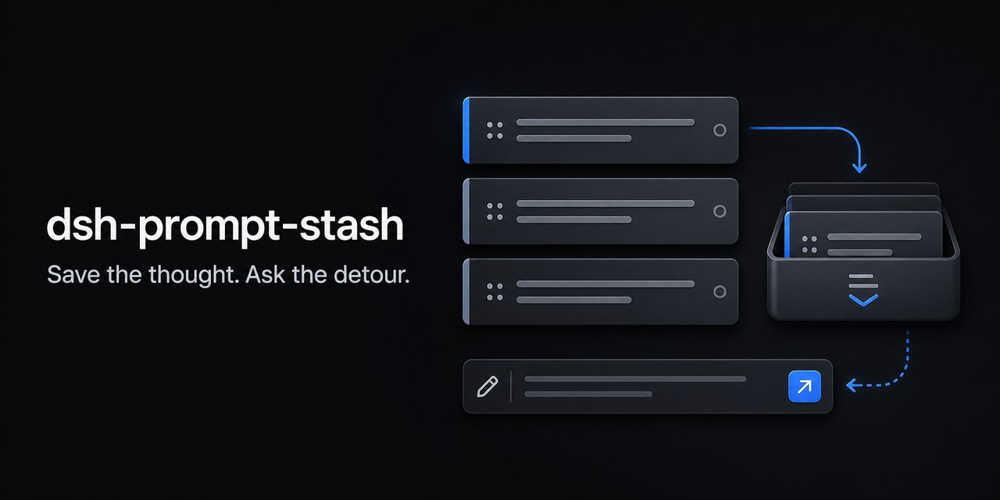
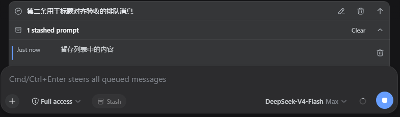

# dsh-prompt-stash

[简体中文](README.md) | [English](README.en.md)

A local prompt-stash plugin for DeepSeek Harness Web. Push unsent plain-text input onto a per-session LIFO stack, handle a quick detour, and safely restore the original prompt afterward.

> Prompt Stash is not draft synchronization. DSH already persists the current composer draft; this plugin provides explicit temporary copies that you can stash, restore, and delete.

## Features

- Keeps an independent stack for each DSH session, newest first, with up to 10 entries.
- Shows a collapsed stash bar above the composer immediately after stashing; expand it to preview, restore, delete, or clear entries.
- Never silently overwrites non-empty input; restoring requires confirmation to stash the current input first.
- Clears and restores input through the official DSH `inputActions.setDraft()` API without manipulating the `textarea` or internal stores.
- Runs entirely in the browser with no network requests; content stays in the current browser's `localStorage`.
- Supports Chinese and English, light and dark themes, keyboard navigation, and a layout that integrates with DSH's native queued-message panel.
- Records a single-key or key-combination shortcut under **Settings → Plugins → Plugin configuration**; the default is `Ctrl+S`.

The current version supports plain text only. Input containing images, attachments, or file references cannot be stashed.

## Preview



Stashed prompts are collapsed by default. Expand the panel to see the creation time and a two-line text preview, then restore or delete an entry, or clear the current session's stack.

## Requirements

- DeepSeek Harness `0.1.0-rc.6`
- A Web profile
- Node.js 20 or later (source development only)

## Installation

### Release tarball (recommended)

Download `dsh-prompt-stash-0.2.1.tgz` from [Releases](https://github.com/Wine-Red/dsh-prompt-stash/releases/latest), then install it into the Web profile:

```sh
dsh plugin --profile web add ./dsh-prompt-stash-0.2.1.tgz
```

The tarball contains prebuilt artifacts, so installation-time build scripts are not required. Restart DSH Web after installation.

### Local source checkout

```sh
git clone https://github.com/Wine-Red/dsh-prompt-stash.git
cd dsh-prompt-stash
pnpm install --frozen-lockfile
pnpm build
dsh plugin --profile web add .
```

`dsh plugin` adds the bundle to `dsh.profile.bundles` in the target profile. You can inspect the resolved configuration before startup:

```sh
dsh --profile web --dump-config
```

The output should contain the `dsh-prompt-stash` bundle layer and the `prompt-stash` plugin entry.

### Uninstall

```sh
dsh plugin --profile web remove dsh-prompt-stash
```

Uninstalling the plugin does not remove existing `dsh.promptStash.v1` data from the browser. To remove it, delete the corresponding `localStorage` entry from the site's browser data.

## Usage

1. Write a plain-text prompt in the composer.
2. Select **Stash** in the composer toolbar, or press the stash shortcut while the message composer is focused. The input is cleared and a collapsed stash bar appears immediately above it.
3. Enter and send the temporary question.
4. Expand the stash bar and select the prompt you want to restore.
5. If the composer already contains text, choose **Stash current input and restore this item**, or cancel.

Successful add and delete operations do not show toast notifications. Error notifications appear only when storage or composer updates fail.

Press the shortcut again while the message composer is empty to restore and pop the latest stash. Repeating this walks backward through the LIFO stack. The shortcut never restores over whitespace, images, or file references already in the composer.

### Configure the shortcut

Open **Settings → Plugins → Plugin configuration → Prompt stash**, focus the shortcut field, press one key or a key combination, and save. Changes take effect immediately. The default is `Ctrl+S`; a single key such as `F8` is also supported. The shortcut stashes non-empty input and restores the latest stash when the composer is empty. It only runs in the message composer. A printable single-key shortcut consumes that character's normal typing behavior.

## Data and security boundaries

- Storage key: `dsh.promptStash.v1`
- Settings key: `dsh.promptStash.settings.v1`
- Scope: the current browser, isolated by `sessionId`
- Stored data: text, ID, creation and update timestamps, and schema version
- Not stored: image data, attachment contents, file contents, credentials, or environment information
- No network requests and no telemetry

Clearing the site's browser data also removes all stashed prompts.

## Development and packaging

```sh
pnpm install --frozen-lockfile
pnpm format
pnpm typecheck
pnpm test
pnpm build
pnpm pack
```

The project follows the official DSH bundle package layout:

- `dsh.bundle.patch` in `package.json` declares the configuration layer.
- `cordis.patch.yml` mounts the plugin by package name.
- `lib/` contains the prebuilt runtime entry points and is included in the tarball.
- The client registers the `conversation.input.left`, `conversation.input.dock`, and `settings.plugin.item` slots.

See the [official DeepSeek Harness documentation](https://deepseek-harness.github.io/deepseek-harness/develop/basic/publish) for packaging and installation details.

## License

[MIT](LICENSE)
